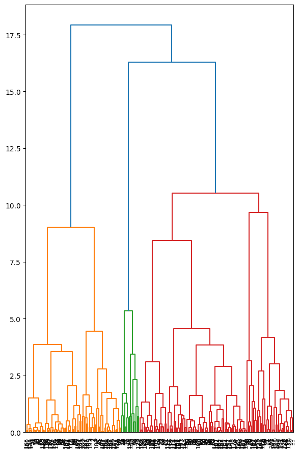

# Automotive Clustering

### —— Identifying Competitors for Volkswagen Cars

<!-- 
老师和同学们上午好，我们小组的 Project Topic 是 Identifying Competitors for Volkswagen Cars ，也就是利用聚类分析来识别大众汽车的竞争对手。
-->

---

# Introduction

- **Objective**: Cluster 205 automotive products to identify competitors of Volkswagen.
- **Key Features**: `carbody` and `price` are prioritized.
- **Method**: 
  - Hierarchical Clustering (DIANA)
  - Prototype Clustering (K-means)
  - Density Clustering (DBSCAN).

<!-- 
那么具体而言，我们的 Objective 是对市场中的 205 款汽车产品进行聚类，以识别大众汽车的 competitors。在初步查看 Dataset后，基于我们的生活经验和常识，我们特别关注了两个特征，分别是 carbody（车身类型）和 price（价格）。我们使用了三种分别对应不同经典聚类思想的方法来完成分析：Hierarchical Clustering（层次聚类）、Prototype Clustering（原型聚类）和Density Clustering（密度聚类）。
-->

---

# Data Preprocessing

- **Feature Selection**:
  - Extracted `brand` from `CarName`.
  - Removed irrelevant `car_ID`.

<!-- 
在 data preprocessing 阶段，我们首先从`CarName`中提取了单独的 Brand 这个 Feature，并移除了不相关的 `car_ID` feature。这一步是为了确保我们只保留对聚类有用的特征。
-->

---

# Data Preprocessing

- **Data Cleaning**:
  - Corrected spelling errors in `brand`.
  - Retained 24 outliers after Z-score analysis.

<!-- 
接下来我们进行了 Data Cleaning，修正了 brand 这个 feature 中的拼写错误，并根据查阅的资料确认了 Z-score 分析中发现的24个离群值的合理性。
-->

---

# Data Preprocessing

- **Feature Merging**:
  - Calculate the correlation matrix.
  - Reduced multicollinearity by merging highly correlated features into 19.

<!-- 
最后，我们通过计算 correlation matrix，合并了高度相关的特征，进而将特征数量减少到19个。这一步是为了降低 multicollinearity，提高聚类的效果。
-->

---

# Hierarchical Clustering
## DIANA

- **Factor Analysis**:
  - KMO score: 0.8035.
  - 7 factors retained (80\% variance).
- **Clustering**:
  - Cut dendrogram at scale 10, thus 4 clusters.
  - Volkswagen products found in "Mid Price Comfortable" and "Mid Price Practical".

<!-- 
在 Hierarchical Clustering 中，我们首先进行了因子分析，保留了7个因子。然后根据我们对 DendroGram 的观察，我们将 Cut Value 设在 10 这个 significant point 上，得到了4个聚类。聚类的结果中，大众汽车的产品主要分布在 “中价舒适型” 和 “中价实用型” 两个聚类中。
-->

---

# Prototype Clustering
## K-means

- **PCA**:
  - Normlized data, weighted `price` and `carbody` by 1.25.
  - Retained 7 dimensions (80% variance).
- **Clustering**:
  - Chose `k=5` based on Elbow Plot.
  - Volkswagen products in "Mid Comfortable Cars" and "Mid Practical Cars".

<!-- 
在 Prototype Clustering 中，我们首先对数据进行了PCA降维，保留了7个维度。然后，我们根据Elbow Graph 选择了 k=5 进行K-means聚类，不选择 2 这个更曲折的点是由于聚类的数量需要有合理性。那么最后的结果显示，大众汽车的产品同样分布在 “Mid Comfortable Cars” 和 “Mid Practical Cars” 两个聚类中。
-->

---

# Density Clustering
## DBSCAN

- **PCA**:
  - Similar preprocessing as K-means.
- **Clustering**:
  - Optimized `eps=4.05` and `min_samples=3`.
  - Resulted in 2 clusters, with Volkswagen in "Mid MPVs".

<!-- 
在 Density Clustering 中，我们也进行了与 Prototype Clustering 中相似的 PCA 预处理。然后，我们使用网格搜索优化 DBSCAN 的参数，并根据得到的参数使用 DBSCAN 进行聚类，最终得到了2个聚类。结果中，大众汽车的产品主要分布在 “Mid MPVs” 聚类中。
-->

---

# Results and Comparison

| **Method** | **Silhouette Score** | **Calinski-Harabasz Score** | **Davies-Bouldin Score** |
| ---------- | -------------------- | --------------------------- | ------------------------ |
| DIANA      | 0.2835               | 87.8302                     | 1.2783                   |
| K-Means    | 0.1642               | 36.0311                     | 1.8688                   |
| DBSCAN     | 0.3590               | 9.0123                      | 0.9466                   |

- **Silhouette Score**: How similar an object is to its own cluster compared to other clusters.

- **Calinski-Harabasz Score**: The ratio of between-cluster dispersion to within-cluster dispersion. 

- **Davies-Bouldin Score**: The average similarity ratio of each cluster with the cluster that most similar to it.

<!-- 
最后，我们对三种聚类方法的结果进行了比较。虽然单独从这些指标来看，DBSCAN 的表现最好，但综合指标和实际聚类结果来看，DIANA 的结果是最好的。
-->

---

# Conclusions

- **Best Method**: Factor Analysis + DIANA.

- **Competitors**: 
  - Filtered by price range 0.8 to 1.2 times of Volkswagen.
  - Filtered by Hierarchical Clustering result.

<!-- 
综上所述，我们认为 Factor Analysis 结合 DIANA 进行 Hierarchical Clustering 是最佳的方法。

那么对于最后的 Identified Competitors，我们通过两个标准进行筛选，一，价格为大众汽车的平均价格 0.8 到 1.2 倍；二，在 Hierarchical Clustering 的 Result 中，与大众汽车同一个 Cluster 的产品。

好的， 以上就是我们小组的 Presentation，谢谢大家！
-->
